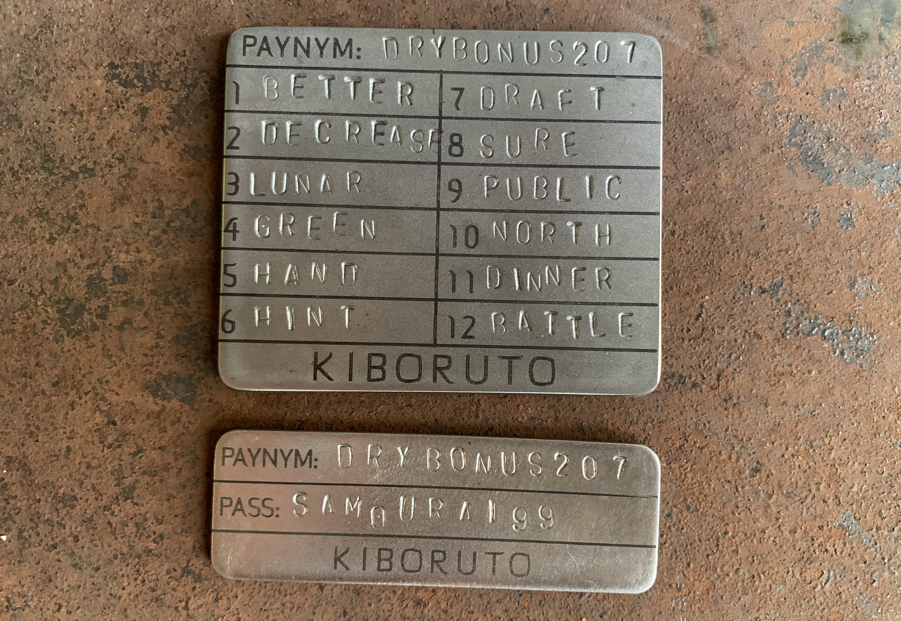

# Stamping the Kiboruto

Once you have setup your wallet and identified your PayNym, you can navigate back through the menu to display your seed words and then stamp them into the Kiboruto like shown in this video: 

Now you should have your seed words, unique PayNym, and your passphrase secured in metal on the Kiboruto. This way you have the information needed to restore your Samourai Wallet and recover your Bitcoin in case your phone is lost, damaged, or stolen or your backup is exposed to fire of flooding.

