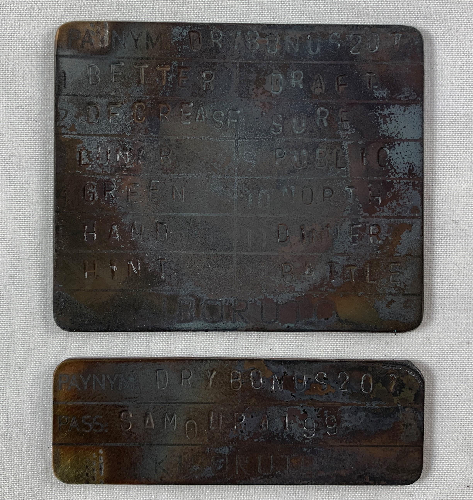

# Kiboruto Fire Test
Any stainless steel backup should be able to withstand fire or flooding. Testing these backups is important to verify that the information contained within is recoverable. You may not want to or may not have the tools/skills necessary to conduct your own fire test, so here is an example of the Kiboruto being brought up to just under melting point, 1,500° C.  

The Kiboruto successfully secured the vital information needed in order to restore the Samourai Wallet and regain access to the bitcoin. The seed phrase is 100% recoverable and even most of the etching survived.  

