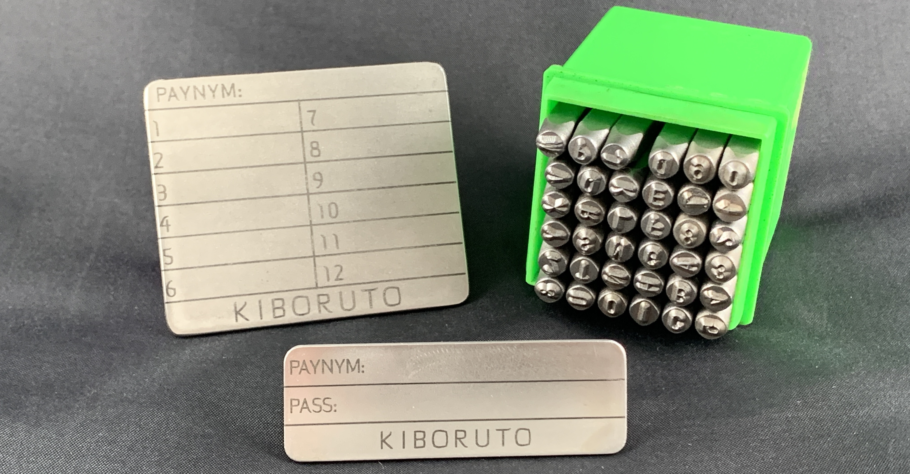
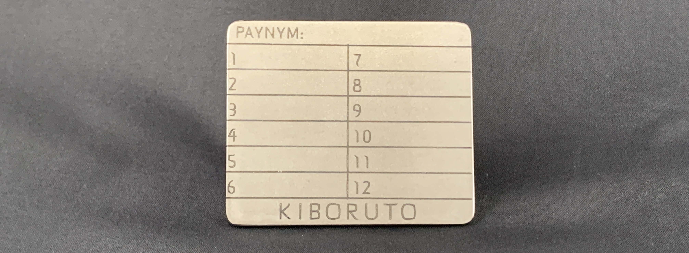
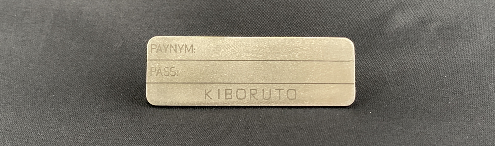
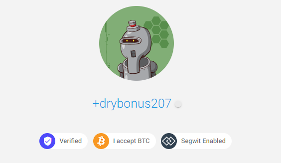

# Kiboruto
Kiboruto is the tailor made stainless steel backup for your [Samourai Wallet](https://samouraiwallet.com/).

This guide demonstrates how to setup a fresh Samourai Wallet on Android and secure the seed phrase in a robust stainless steel backup made by [@Crazyk_031](https://twitter.com/Crazyk_031) & [@stackbitme](https://twitter.com/stackbitme).

## Introduction
If you have taken self-custody of your bitcoin, congratulations on taking the first steps toward leading a permissionless life. Now make sure your bitcoin is secure and safe from environmental hazards like fire & flood. Writing down your backup information in a notebook is a good start but at some point you may find that this no longer feels secure enough when you take environmental hazards into account.

When you take the radical responsibility of self-custody over your bitcoin, you and you alone are responsible for those funds. There is no charge-back feature or 1-800 helpline with Bitcoin, so you want to be sure you take every precaution in protecting your funds. Since the Kiboruto is tailor made for Samourai Wallet, that will be the focus of this guide. With Samourai Wallet, there are three key pieces of information you want to secure:

## Seed Words
1) When you setup Samourai Wallet, you will be given a list of 12-words known as your seed words. Sometimes also referred to as your seed phrase or mnemonic phrase. These 12 seed words are a key piece of information that allows you to restore your Bitcoin wallet in the event that you lose your phone, or it is stolen, or it is damaged beyond repair for example. Seed words always need to be saved in the same order your wallet presents them to you. If you get even one word in the wrong order it could render your bitcoin backup useless. Be prepared for the worst and secure your seed words like they were gold or jewelry. 

## Passphrase
2) You will also set a passphrase when generating your Samourai Wallet. The passphrase is something unique that you set, it is not generated by Samourai Wallet. Your Samourai Wallet has no way of knowing what passphrase you set, also any passphrase you enter will generate a valid wallet. Whether that is the wallet which contains your bitcoin or not depends on your ability to enter the same passphrase as the one you originally set when setting up your wallet for the first time. Unlike seed words, which come from a predefined list of 2,048 English words, a passphrase on the other hand can include any combination of lower/upper case letters, numbers, and special characters you want to use. 

## PayNym
3) Last but not least is your PayNym. The PayNym is a unique name and avatar that is associated with your wallet. You can use this PayNym to verify that you have in fact restored the correct wallet. Your PayNym is capable of a lot more though: Display a static payment code to receive funds without revealing any of your prior transaction history to anyone. Use your PayNym to connect with other Samourai Wallet users so that you can build collaborative CoinJoin transactions like Stowaway or StonewallX2. Checkout [usecahoots.com](https://www.econoalchemist.com/post/putting-the-who-in-cahoots) to learn more. 

The next section will walk you through exactly how to get these three pieces of information from a new Samourai Wallet.
